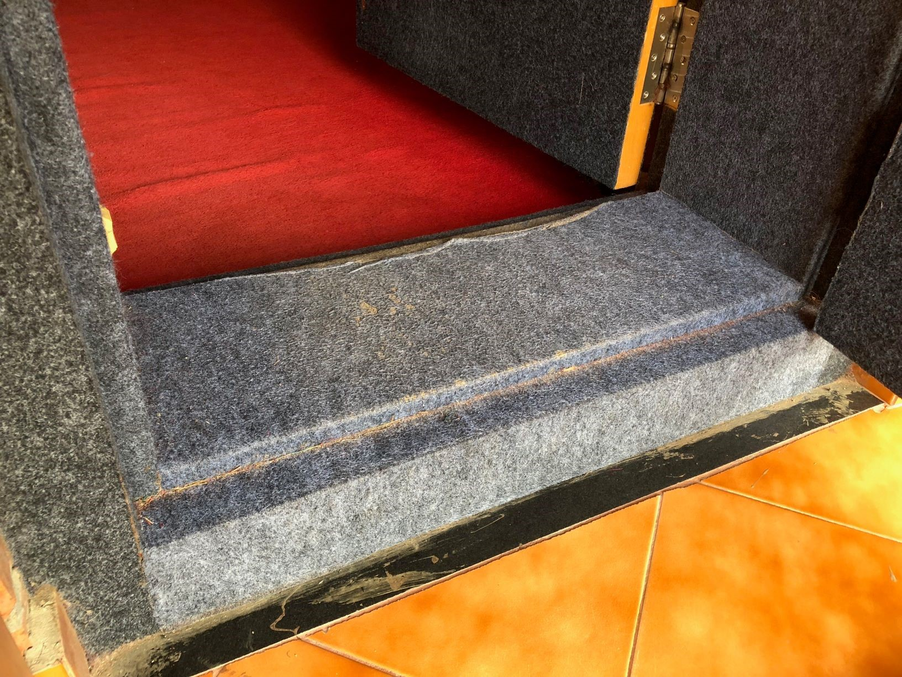
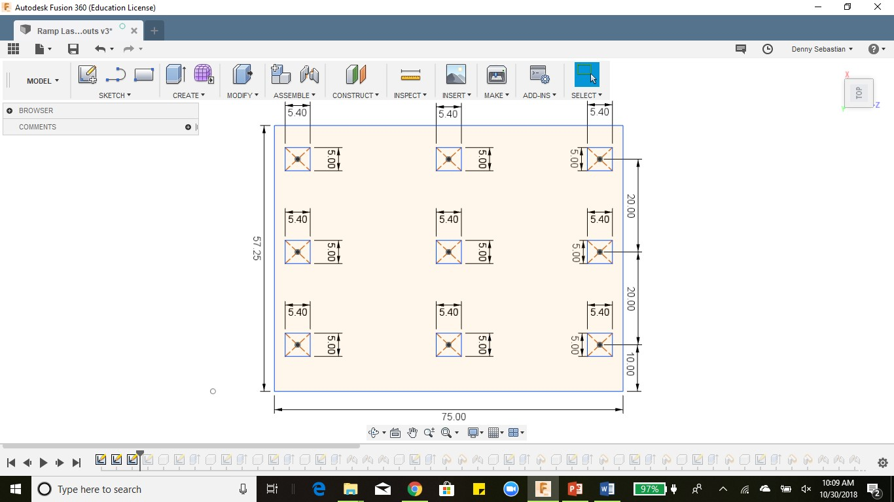
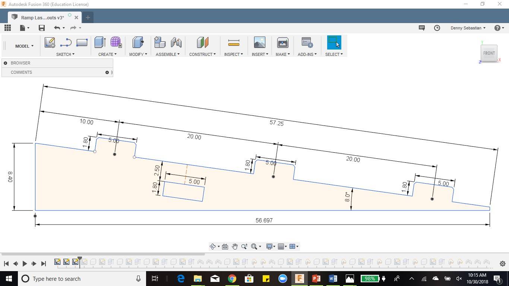
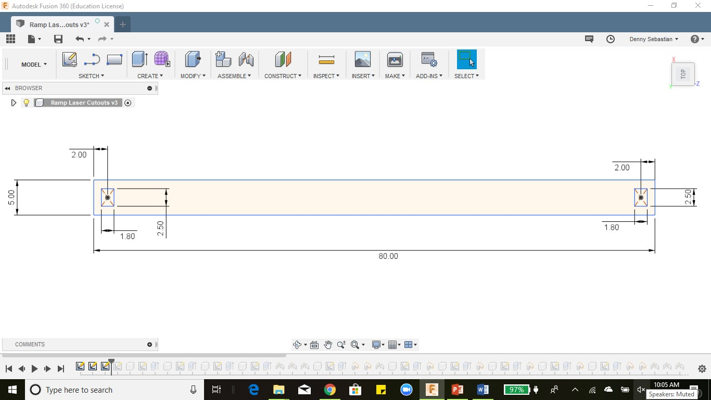
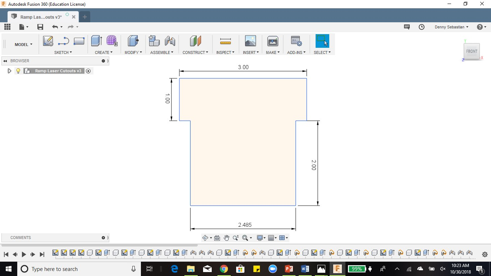
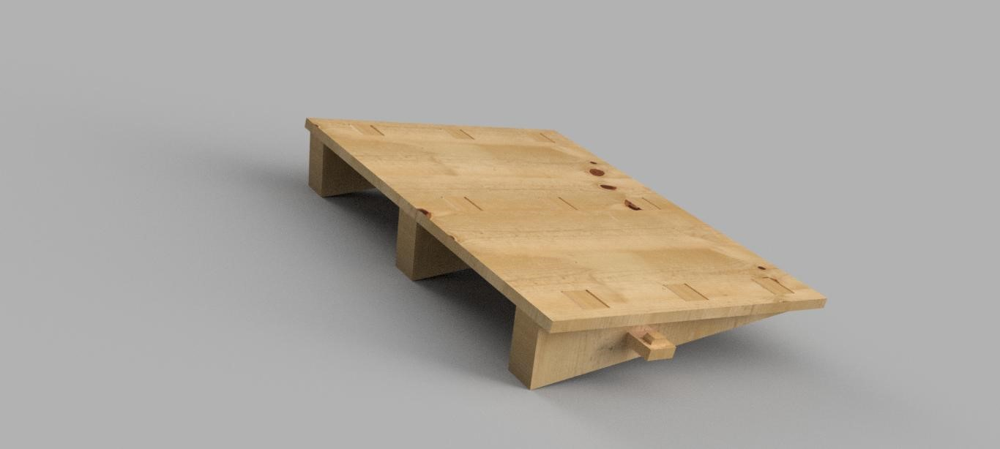

# Portable Ramp

## Purpose
The ramp is designed to enable people using wheelchair to access rooms having a high door step as the one shown:

## Overview
Most buildings are not designed with accessibility in mind which can make it burdensome for people who have difficulty walking, or need a wheelchair to move around. The idea behind the portable ramp happened at NISH when visitors/patients using the wheelchair complained that they could not enter some of the audiology rooms as there was a tall step obstructing their path.

The team at CATI came up with the idea to construct a ramp made out of wood which was sturdy, inexpensive and portable.

## Project Creation
  ### Ramp Components and Dimensions
  The ramp consists of two main components, a plank and an incline block.  The incline block is designed to set the plank at an angle of
  10 degrees. About 9 incline blocks are assembled to fit the plank. Other components include a support beam with fixtures to hold the
  ramp in place.
  
  To determine the dimension of the ramp, using a measuring tape, we measured the height of the step, width of the doorway at the entry
  and exit of the room. The dimensions of the step were found to be:
  
  Width: 75 cm
  
  Height: 10.2 cm

  From the above dimensions and keeping in mind the angle of the ramp at 8 degrees, we found the dimensions of the Plank to be:
  
  Length: 57.25 mm
  
  Width: 75 mm
  
  Thickness: 18 mm
  
## Autodesk Fusion Model of Ramp
This project requires a good knowledge of navigating Autodesk Fusion and its features. Autodesk Fusion was used to construct a 3D model of the ramp assembly. To create the ramp, sketches of each component were made. The dimensions, in centimeters, of each sketch are shown in the given figures:

### Plank:

### Incline Block:

### Support Beam:

### Fixtures:

After creating the sketches, the components are designed next. Each component is extruded with a thickness of 18 mm. As part of the assembly, 9 copies of the incline block component are created.

## Assembly
The rendered image of the assembled ramp is shown below:

## Fabrication
After completing the 3D model design and the assembly of the components are successful. The next step involves fabrication of the components using a Laser Cutter tool. A 6 feet by 4 feet plywood material, 18 mm thick, is placed on the Laser Cutter to cut out the components.

// find out fabrication process involved

// To Be Added: (write about Autodesk Fusion… design process involved… add pics of design… final assembly… add details of plywood board… add method of fabrication… observe fabrication process… take pic of fabrication… explain assembly process… take pic of assembly process step by step… pic of plank being used in NISH…  get user feedback…)
